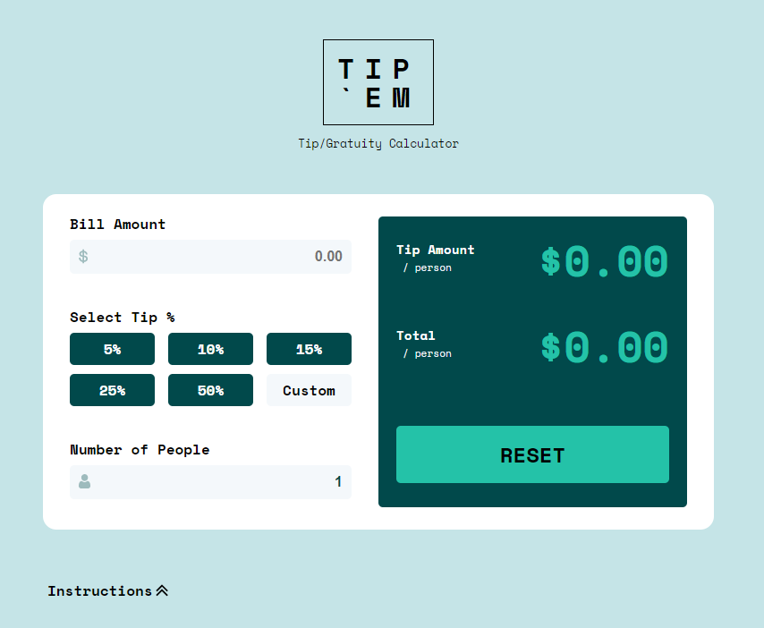
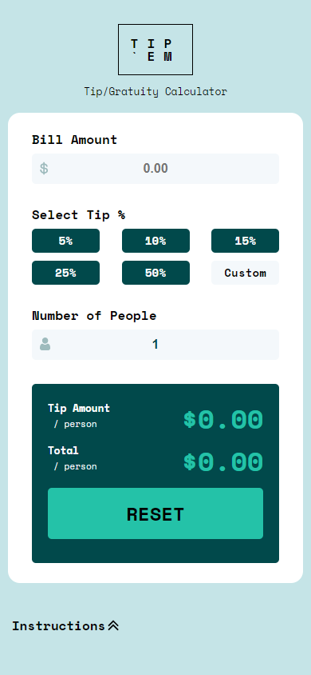
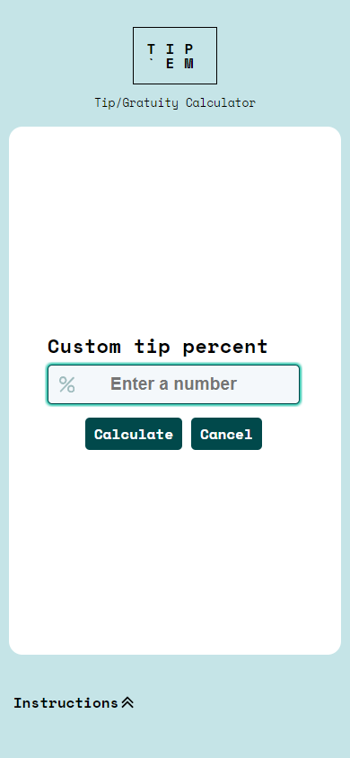

# Frontend Mentor - Tip calculator app
 
## Current Progress
Almost done. Here's what else is needed:
1. ~~Need to work on the Custom button functionality. I will likely make a modal for it instead of using Front End Mentor's suggestion~~. Complete. I may make the entire background somewhat opaque in the future.
2. ~~Add icons to input fields (Dollar sign and People icon)~~
3. Mobile queries for tablets over 500px;
4. ~~Remove arrows from input fields (Firefox)~~
5. ~~Add % sign custom percentage input field.~~
6. ~~Add functionality if someone presses the Enter button to calculate the Custom Tip.~~ Done. Works on desktop view.

---
# Screenshots
## Desktop

## Mobile
Screenshots based off an iPhone 12

  

## Future Considerations
I'd like to change the color scheme at some point. I might work with these colors:
```css
    --dark-color: #034769;
    --light-color: hsl(199deg 54% 94%);
    --bg-color: hsl(199deg 44% 69%);
    --results-color: hsl(199deg 76% 53%);
    --active-color: hsl(199deg 54% 74%);
```

